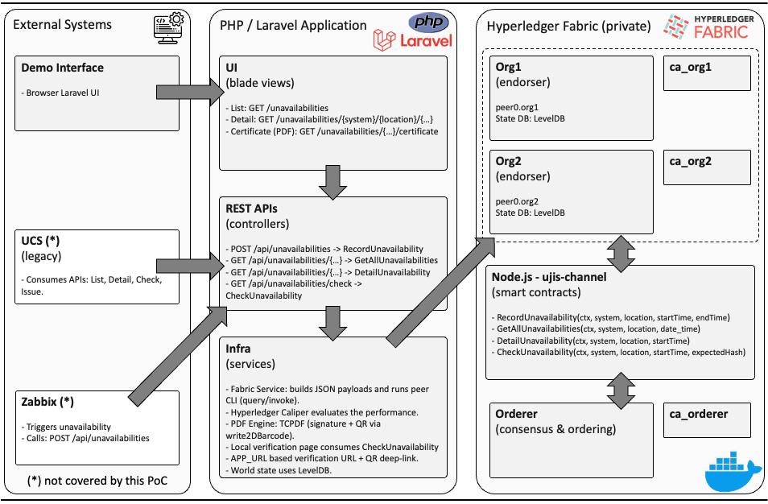

# UJIS — Tokenisation of the Unavailability of Judicial Information Systems (Implementation)

> **Implementation repository** for recording, certifying, and verifying **system unavailability** events on a **private Hyperledger Fabric** network.  
> Backend/API and lightweight UI are built with **PHP/Laravel**; smart contracts are **Node.js (TypeScript)** chaincode. This codebase underpins the implementation described in the paper **“Tokenisation of the Unavailability of Judicial Information Systems – From Assessment to Implementation.”**



---

## 1) Scope & deliverables

This repository provides:

- **Laravel application** (UI + REST API):
  - **UI (Blade)** to browse unavailability records, view details, and **issue digitally‑signed PDF certificates** with QR/verification URL.
  - **REST API** that maps 1:1 to chaincode: list, detail, record, integrity check.
- **Fabric CLI wrapper** (`App\Services\FabricService`) that prepares the Fabric test‑network environment and runs `peer chaincode query/invoke` with the full TLS flags.
- Configuration for **local certificate signing** (TCPDF signature via PEM cert/key) and a **verification page** that consumes the API to display existence & integrity outcomes.
- **Node.js (TypeScript) chaincode** implementing the unavailability contract (keys: `system:location:startTime`) with LevelDB world‑state and range/prefix scans.

> For file‑level changes over time, see **CHANGELOG.md**. The README focuses on “what this is, how to run, how to use, how to verify, and how to extend.”

---

## 2) Repository layout (high level)

```
ujis-api_ui/      # Laravel app (UI + REST APIs, certificate issuance & verification)
ujis-ts/          # Node.js (TypeScript) chaincode for Hyperledger Fabric
docs/             # Documentation assets (e.g., system_diagram.png)
```

---

## 3) Prerequisites

- **Hyperledger Fabric** development environment (e.g., fabric-samples `test-network`)  
  - Channel: `ujis-channel` (configurable)  
  - Chaincode name: `basic` (configurable)  
  - World‑state: **LevelDB** (default)
- **Node.js** LTS (for chaincode build/deploy)
- **PHP 8.2+** (tested with PHP 8.4) and **Composer 2.x**
- **OpenSSL** (to generate a local signing key/cert for PDFs)

---

## 4) Quick start

### 4.1 Deploy the chaincode (Node.js/TS)

From `ujis-ts/` (commands below are indicative—adapt to your network tooling):

```bash
# build/prepare chaincode (adjust scripts as per ujis-ts package.json)
npm ci
npm run build

# package, install, approve, commit on your channel
# (use your standard Fabric workflow; names below are placeholders)
peer lifecycle chaincode package basic.tar.gz --path . --lang node --label basic_1
# peer lifecycle chaincode install …
# peer lifecycle chaincode approveformyorg …
# peer lifecycle chaincode commit -C ujis-channel -n basic …
```

### 4.2 Configure and run the Laravel app

From `ujis-api_ui/`:

```bash
composer install
cp .env.example .env
# edit .env (see excerpt below)
php artisan key:generate

# optional optimisation for local
php artisan config:cache

# run
php artisan serve   # -> http://127.0.0.1:8000
```

**Key environment variables** (excerpt in `.env`):

```dotenv
APP_URL=http://127.0.0.1:8000

# Fabric integration (adjust absolute paths to your machine)
FABRIC_CHANNEL=ujis-channel
FABRIC_CC_NAME=basic
FABRIC_ENV_SCRIPT=/…/fabric-samples/test-network/scripts/envVar.sh
FABRIC_ENV_FN="setGlobals 1"
FABRIC_WORKDIR=/…/fabric-samples/test-network
FABRIC_BIN_PATH=/…/fabric-samples/bin
FABRIC_CFG_PATH=/…/fabric-samples/config
FABRIC_QUERY_PREFIX="peer chaincode query"
FABRIC_INVOKE_PREFIX="peer chaincode invoke -o … --tls … --cafile … --peerAddresses … --tlsRootCertFiles …"

# Certificate issuance (local development)
CERT_PEM=/abs/path/to/certs/cert.pem     # public cert (X.509)
CERT_KEY=/abs/path/to/certs/key.pem      # private key (DO NOT COMMIT)
CERT_PASS=                                # if the private key is password‑protected
```

> **Security:** Never commit private keys or `.env`. The repo’s `.gitignore` is configured to block them. Only public `.cer/.crt` files (no private key) may be versioned if needed for verification.

---

## 5) Using the system

### 5.1 UI (human‑friendly)

- **List:** `GET /unavailabilities`  
- **Detail:** `GET /unavailabilities/{system}/{location}/{startTime}`  
- **Issue certificate (PDF):** `GET /unavailabilities/{system}/{location}/{startTime}/certificate`  
  - The PDF is **digitally signed** (TCPDF) and embeds a **QR** pointing to the local verification URL.

### 5.2 REST API (machine‑friendly)

| Method & Path | Purpose | Chaincode |
|---|---|---|
| `GET /api/version` | Component/version probe | `FunctionVersion` |
| `GET /api/unavailabilities?system=&location=&date_time=` | List with optional filters | `GetAllUnavailabilities` |
| `GET /api/unavailabilities/{system}/{location}/{startTime}` | Retrieve canonical detail | `DetailUnavailability` |
| `POST /api/unavailabilities` | Record an event (`{"system","location","startTime","endTime"}`) | `RecordUnavailability` |
| `GET /api/unavailabilities/check?system=&location=&date_time=&hash=` | Integrity check (expected SHA‑256) | `CheckUnavailability` |

**Notes:**  
- `date_time` accepts a single instant (`{"at": "…ISO…"} `) or an interval (`{"from": "…", "to": "…"} `).  
- The **verification hash** is computed over canonical fields: system, location, start, end, **duration (minutes)**, and blockchain timestamp.  
- The UI verification page can compute the hash automatically when absent; the **API requires `hash`**.

**Examples:**

```bash
# List all
curl http://127.0.0.1:8000/api/unavailabilities

# Detail one record
curl http://127.0.0.1:8000/api/unavailabilities/PJe-1G/SJ-BA/2025-08-25T09:02:00-03:00

# Record a new unavailability
curl -X POST http://127.0.0.1:8000/api/unavailabilities \
  -H "Content-Type: application/json" \
  -d '{"system":"PJe-1G","location":"SJ-BA","startTime":"2025-08-30T12:00:00Z","endTime":"2025-08-30T13:30:00Z"}'

# Check integrity (when you already have the expected hash)
curl "http://127.0.0.1:8000/api/unavailabilities/check?system=PJe-1G&location=SJ-BA&date_time={\"at\":\"2025-08-30T12:00:00Z\"}&hash=<sha256>"
```

---

## 6) Certificate issuance & verification

- Certificates are generated with **TCPDF** and **digitally signed** using your local PEM pair.  
- The PDF embeds a **verification URL + QR** to `GET /verify/{system}/{location}/{startTime}?hash=<sha256>` (served by the Laravel app).  
- The verification page calls the **`check`** API and renders **existence + integrity** results alongside the **matched canonical record** when available.

For development, self‑signed credentials are acceptable; for production deployments, use an issuing CA recognised by your audience (e.g., trusted in Adobe and OS stores) and define rotation/CRL/OCSP policy.

---

## 7) Integration points (Zabbix / UCS)

- **Zabbix** or any monitoring platform can POST directly to `POST /api/unavailabilities` from an action/webhook when outages are detected.  
- **UCS (legacy)** can consume the **list/detail/check** endpoints and/or link to the **verification page** for court use.

Payloads are intentionally simple JSON to reduce coupling and enable gradual adoption across systems.

---

## 8) Operations & troubleshooting

- The **FabricService** shells into your Fabric environment (`envVar.sh` + `setGlobals N`), exports `PATH` and `FABRIC_CFG_PATH`, and then runs the `peer` CLI. Errors will include the CLI’s stderr if configuration is incorrect (paths, channel, chaincode name, TLS flags).  
- Output sanitisation removes ANSI colour codes and extracts the **first valid JSON block** from noisy logs.  
- If verification shows “not found”, ensure the **`startTime` in the URL matches exactly** the key used at write time (it is part of the composite key).  
- For long invokes, adjust `FABRIC_WAIT_TIMEOUT` (seconds). The wrapper adds a safety margin to the process timeout.

---

## 9) Security notes

- **Do not commit** private keys (`*.key`, `*.p12`, `*.pfx`, `*.jks`) or your `.env`. Use environment variables/secrets in CI.  
- Public certificates (`.cer/.crt` **without** private key) can be versioned if useful for verification in test environments.  
- Confirm any committed certificate is **public‑only** (`openssl x509 -in cert.cer -noout -text`) and never contains a “PRIVATE KEY” block.

---

## 10) Roadmap (suggested)

- Pagination and cursor‑based scans for large ledgers.  
- Optional off‑chain cache for API latency under load.  
- Containerised packaging (Docker) with runtime secret mounts.  
- OpenAPI/Swagger for the REST surface.  
- Formal CA chain and trust distribution for Adobe/OS validation in production.

---

## 11) Licence

MIT (or your institution’s required licence). See `LICENSE` if present.

---

### Maintainer

- Fernando Escobar

If you have questions or want to propose improvements, please open an issue or PR.
